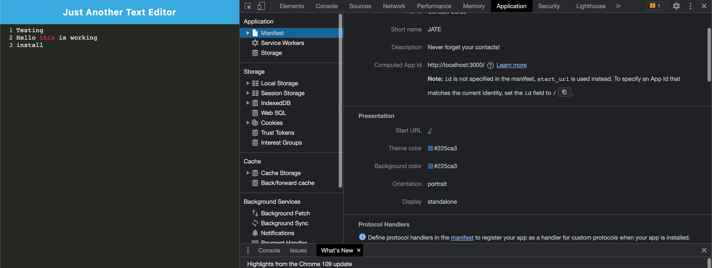

# Text Editor PWA
  
  ## Table of Contents
  * [Description](#description)
  * [Installation](#installation)
  * [Usage](#usage)
  * [Licenses](#licenses)
  * [Questions](#questions)
  * [Technology](#technology)

  ## Description 
  This is a text editor that is compatible with webpack, and code, also you can install the text file.
  
  
  
  ![serviceworkers]](./imgs/serviceWorkers.png)
## Installation 
 git clone code or download repo as a zip
## Usage 
"npm i/npm install"
## Licenses 
  ## Licenses
    This project is covered under the MIT license. To learn more about what this means, click the license button at the top.
## Questions 
Any questions about the project?
Github: https://github.com/sppencerr
Email: spencergerritsen@gmail.com
## Technology 
nodemon
manifest.json
WebpackPwaManifest plug-in
Progressive Web Application
Heroku
ibd
babel

